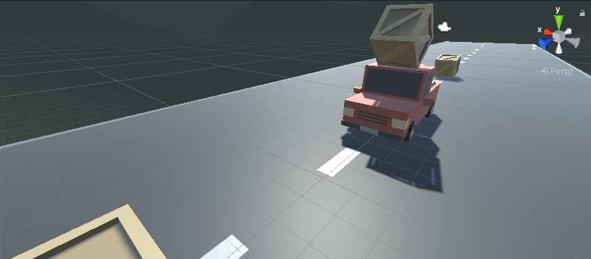
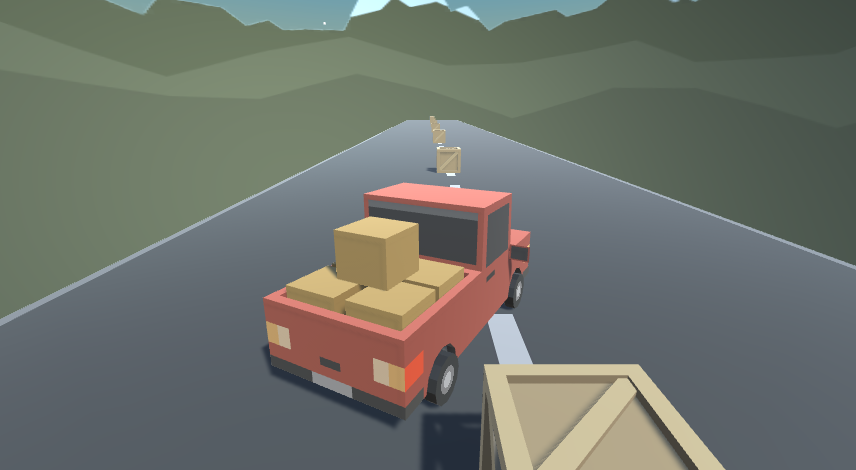
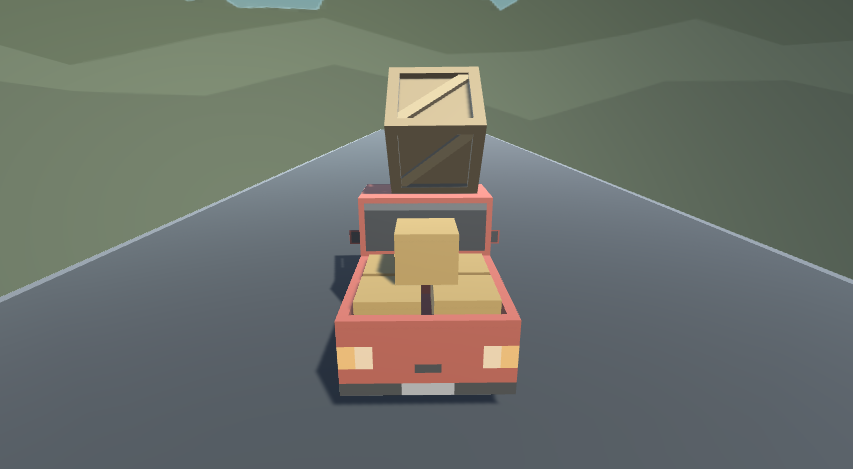

# Unity-ProtoType 1

Unity' nin yayınlamış olduğu junior pathway'de verilen hazır assetlerle oluşturulmuş bir proje:

Paket; skybox , araçlar , yol ve engel nesnelerinin tümünü içeriyor.

                    

Araç ok tuşlarını kullanarak sağ, sol, ileri ,geri verdiğimiz hız ile hareket edebiliyor,engellere çarptığında engeller, ağırlığına bağlı olarak sürükleniyor ya da yuvarlanıyor.

                    

 

